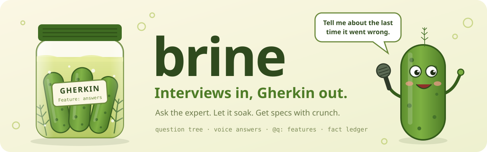

<p align="center"></p>

# brine

[](https://skills.sh/shinyobjectz/brine) [](LICENSE)

Interviews in, Gherkin out.

brine is a question tree you send to someone who knows a process better than anyone, and can't
describe it. They answer one question at a time, typed or spoken. Their recordings are transcribed on
the server, a decision model reads each free answer to choose which follow-up to ask, and the
answers come back as a bundle that Claude turns into `.feature` files.

- **The tree** (`src/spec.ts`, `src/walk.ts`). Chapters of questions, walked in order. `when` guards
  skip what does not apply, `next` jumps go forward, and `decide` asks
  [Jev](https://openrouter.ai/typesafe/jev-1.13) typed questions about an answer ("does this name an
  exception?", "who caused the delay?") so later guards branch on what was said. `brine check`
  proves every address resolves, every jump goes forward and every guard looks back, and it samples
  walks to tell you how long a sitting is.
- **The page** (`src/ui`). One question at a time with a chapter list to jump around, and a waveform
  button in the answer box that records. The respondent never sees transcripts, reasons, branches or
  Gherkin.
- **The Worker** (`src/worker.ts`). A dependency-free Cloudflare Worker: invite links and passcodes,
  each respondent's walk in its own Durable Object, recordings and an append-only answer log in R2, transcription through OpenRouter's speech-to-text endpoint
  (`openai/gpt-4o-mini-transcribe` by default), decisions through OpenRouter's Decisions API, and an
  admin export.
- **The loop** (`src/loop.ts`). What happens after the first round: `brine trace` ties every
  as-is scenario back to the answers it came from (`@q:` tags) and lists answers nothing cites;
  `brine followup` drafts the second round from the features' Rules (read-backs) and `# TODO`s.
- **The ledger** (`src/ledger.ts`). Everything the respondent said that is not behavior (numbers,
  timers, rules, their wording, stories, signals, terms, ideas, risks, metrics) as typed facts cited
  to answers; `brine ledger check|render|emit|records` projects it into code, documents and
  retrieval records.
- **The skill** (`skills/brine`). An agent skill: how to design the questions from a vocabulary or
  pipeline (`references/method.md`), how to write Gherkin from the answers
  (`references/gherkin.md`), and what else the answers become (`references/derivations.md`).

## Use it

```sh
bun install
bun test                                    # the walk, the checker, the Worker
bun bin/brine.ts check example/src/interview.ts
bun bin/brine.ts outline example/src/interview.ts
```

Install the skill for your agent (Claude Code, Cursor, Codex and others) from
[skills.sh](https://skills.sh/shinyobjectz/brine):

```sh
npx skills add shinyobjectz/brine
```

Then ask the agent to "design a brine interview for <who> about <what>". The skill tells it to clone
this repo for the code.

### Host an interview

Write `questions.ts` exporting `interview: Interview`, then:

```ts
// worker.ts
import { brine } from "brine/worker"
import { interview } from "./questions"
const app = brine(interview)
export default app
export const BrineSession = app.BrineSession   // one Durable Object per respondent
```

```tsx
// main.tsx
import { Brine } from "brine/ui"
import "brine/ui/brine.css"
createRoot(document.getElementById("root")!).render(<Brine interview={interview} brand={{ name: "Acme" }} />)
```

`example/` is a complete app. It needs a KV namespace (`BRINE`), an R2 bucket (`BRINE_AUDIO`), and
two secrets: `OPENROUTER_API_KEY` and `BRINE_ADMIN_TOKEN`. The Durable Object (`BRINE_SESSIONS`) and
the passcode rate limit (`BRINE_ENTER_LIMIT`) are declared in `example/wrangler.jsonc`; both are
optional.

```sh
wrangler kv namespace create BRINE           # put the id in wrangler.jsonc
wrangler r2 bucket create brine-example-audio
wrangler secret put OPENROUTER_API_KEY
wrangler secret put BRINE_ADMIN_TOKEN
bun run example:build && wrangler deploy --config example/wrangler.jsonc
```

### Run it

```sh
export BRINE_ADMIN_TOKEN=…
bun bin/brine.ts invite https://your.worker.dev "Sam Baker"   # prints the link to send
bun bin/brine.ts status https://your.worker.dev
bun bin/brine.ts export https://your.worker.dev ./answers      # answers.json + answers.md
```

`answers.md` lists every asked question with its `why` and `yields`, the answer, verbatim
transcripts and Jev's reads. Hand it to Claude with the skill loaded and ask for the features.

## The spec in one screen

```ts
{
  id: "wholesale", kind: "long",
  ask: "Walk me through the last wholesale order, from the call to the van leaving.",
  when: { q: "sources", is: "wholesale" },            // only if they take wholesale
  decide: { exception },                              // Jev: does the answer name an exception?
  why: "The wholesale path end to end, from a real instance.",   // designer only
  yields: "Scenario: a wholesale order — Given/When/Then",      // designer only
},
{
  id: "wholesale_exception", kind: "long",
  ask: "You mentioned it sometimes goes differently. Tell me about the last time it did.",
  when: { q: "wholesale", decision: "exception", is: "yes" },
  why: "…", yields: "Scenario: wholesale exception",
}
```

Kinds: `long`, `text`, `choice`, `multi`, `number`, `scale`. Guards: `is`, `not`, `answered`,
`atLeast`, `decision`, and `all` / `any` / `none`. A decision's `fallback` is used when there is no
model, so pick the result that asks more.

### Close the loop

The first round is not the end. Write the as-is features from `answers.md` with `@q:` tags and
`# TODO` / `# IDEA` / `# CONFLICT` markers, rule on the conflicts (`# RULED:`), write the product
specs, fit them onto a shared step set, then send a short second round that reads the rules back:

```sh
bun bin/brine.ts trace questions.ts answers/answers.json features/**/*.feature   # every @q: resolves, every answer cited
bun bin/brine.ts followup round-2 "Did we get it right?" features/**/*.feature > round2.ts   # draft; rewrite in their words
```

Scenarios hold behavior. Everything else the respondent said (numbers, timers, rules, their wording,
real cases, red flags, terms, wishes, risks, what they watch) goes into one fact ledger, each fact
cited to its answers, and every other artifact is projected from it:

```sh
bun bin/brine.ts ledger check questions.ts ledger.json answers/answers.json   # well formed, every citation a question
bun bin/brine.ts ledger emit ledger.json number timer rule template > src/facts.gen.ts   # code reads constants by id
bun bin/brine.ts ledger render ledger.json idea          # the backlog (risk, term, ... likewise)
bun bin/brine.ts ledger records answers/answers.json ledger.json features/**/*.feature > answers.jsonl   # retrieval
```

The steps are in `skills/brine/SKILL.md`; the markers and the step pass in
`skills/brine/references/gherkin.md`; the ledger's kinds, projections and checks, ranked, in
`skills/brine/references/derivations.md`.

## License

Apache License 2.0. See [LICENSE](LICENSE).
